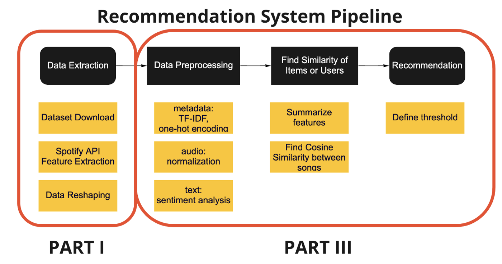

# MOOZEEK: A song recommendation system with listening analysis


## Introduction

The goal of this project is to recommend songs for a given spotify playlist ID and alo show user their top tracks, recently played tracks, top artists.


### Recommendation Model
The recommendation model is summarized in the `ContentBased_RecommendationSystem.ipynb` notebook. This contains the process of building a content-based filtering recommendation. The following parts were covered:

1. Package Setup:
      Firstly, we performed authentication using Spotipy
```
SPOTIFY_API_KEY = os.getenv('SPOTIFY_API_KEY')
SPOTIFY_CLIENT_ID = os.getenv('SPOTIFY_CLIENT_ID')
spotify_search_url = 'https://api.spotify.com/v1/search?q={q}&type={type}'
spotify_headers = {"Accept": "application/json", "Authorization":"Bearer " + SPOTIFY_API_KEY, "Content-Type": "application/json"}
client_credentials_manager = SpotifyClientCredentials(SPOTIFY_CLIENT_ID, SPOTIFY_API_KEY)
spotify = spotipy.Spotify(client_credentials_manager=client_credentials_manager)
```
2. Preprocessing: 

Since this dataset is released by Spotify, it includes a track_id that can be used to generate API calls to access the multiple information that is provided from Spotify for a given song, artist or user. To do all the API calls, we are using Spotipy, which is a lightweight Python library for the Spotify Web API.
These are some of the audio features that are available to us for each song and I will be using them to enhance the dataset to help matching the user’s favorite playlist and to build the model. They are measured mostly in a scale of 0–1:
* Danceability: a measurement of how “danceable” a given song is.
* Energy: perceptual measure of intensity and activity.
* Intrumentalness: whether a song contains no vocals (pure instrumental).
* Liveness: presence of audience in a song i.e.: on a concert.
* Loudness: How loud a song is in dB.
* Mode: Minor or Major mode.
* Speechiness: presence of words in a song.
* Tempo: Beats per minute (BPM).

3. Feature Generation


The first method that we will use in extracting features from tracks in a playlist is the “playlist_tracks” method. This method takes the URI from a playlist, and outputs JSON data containing all of the information about this playlist. Luckily, the Spotipy package decodes this for us, so we can parse through this data fairly easily and Pythonically.

We want to extract the track data here, such that we can get features from this. This can be done through the following section of code, which extracts the URI for each song in the playlist given (still the global top 40 for our example):
```
playlist_link = "https://open.spotify.com/playlist/37i9dQZEVXbNG2KDcFcKOF?si=1333723a6eff4b7f"
playlist_URI = playlist_link.split("/")[-1].split("?")[0]
track_uris = [x["track"]["uri"] for x in sp.playlist_tracks(playlist_URI)["items"]]
```

Extracting Features from Tracks
Now that we have a list of track URIs, we can extract features from these tracks, in order to perform our analysis. Spotify has a list of these features for each of its tracks, from analysis of the audio. We can access these with a single method of the spotify object `audio_features(uri)`. This gives us a list of mostly numerical features that we can use for our analysis.
```
sp.audio_features(track_uri)[0]
```
4. Content-based Filtering Recommendation

Recommendation systems can be split into two different classes: collaborative filtering and content-based filtering. Spotify uses both these algorithms, a hybrid recommender system, to give you that familiar but still fresh playlist.
In this project, I will only be implementing the content based filtering.


Content-based filtering uses the features of each song in a playlist to find the average score of the whole playlist. Then, it recommends a song that has a score similar to the playlist but is not in the playlist.



5. Deployment Using Flask

The recommendation model is deployed with the help of flask.


### Moozeek (Listening Analysis)

This is a website combined with my recommendation engine, and it offers the following features:
1) Top 50 recently played tracks


2) Top tracks of past 1 month, 6 months and all time


3) Top artists of past 1 month, 6 months and all time


4) Top tracks by artists ( All time favourite songs grouped by all time favourite artists)


5) Song Recommendation Engine using Playlist ID


The website is deployed with the help of flask and currently runs on local host.


### Deployment For recommendation Engine

Installing dependencies in virtual environment and running the app:
```
cd song_recommendation
pip3 install -r requirements.txt
python wsgi.py
```
### Deployment For Moozeek
Installing dependencies in virtual environment and running the app:

```
pip install -r requirements.txt  or pipenv install -r requirements.txt 

python app.py 
```

## Repo Structure
```
│
├── README.md <- The top-level README for developers using this project.
├──Recommendation_Engine
│   ├── notebooks <- Serialized Jupyter notebooks created in the project.
│   │     ├── Extraction<- Data extraction using Spotify API
│   │     ├── EDA<- Exploratory data analysis process.
│   │     └── Recsystem<- The training of traditional statistical models.
│   │
│   │
│   ├── application <- Code for model deployment and website design
│   ├── data <- Pretrained data for model
│   │
│   │
│   ├── wsgi.py  <- Python File to run the app
│   └── requirements.txt <- The requirements file for reproducing the analysis environment.
│ 
└── Moozeek(Listening Analysis) <- Code for webpage showing users their top tracks,recently played tracks and top artists
```
